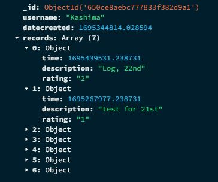
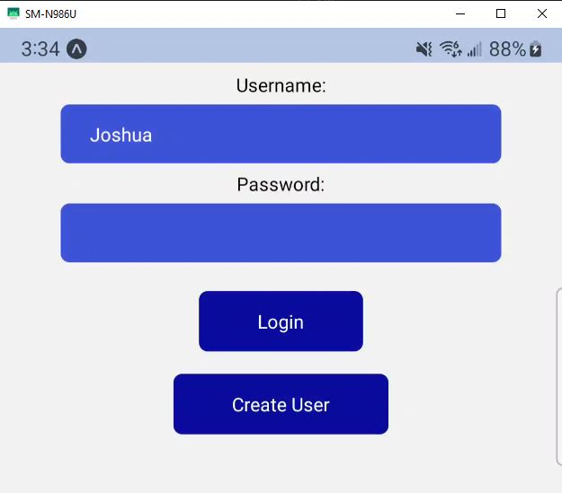
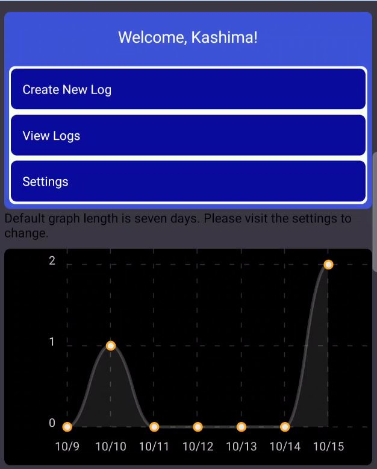
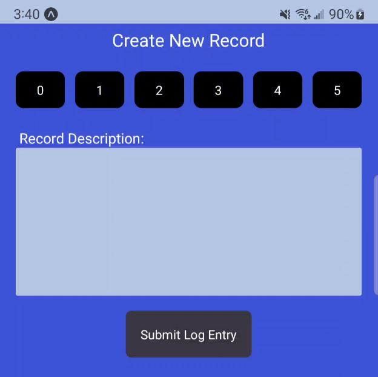

# MEDLOG Capstone Project 23

## Progress Point 1: 

- General layout and structuring of infrastrcture and application. 
- Had several prototypes before but decided to start from scratch and rework it.
- Front end: React Native
- API: Python
- Database: MongoDB

## Progress Point 2:

### Database:

Database has been created with the following structure:
The user is created and a `datecreated` field is populated with the time of creation. Following that the records array is initialized and the user is ready to start logging data.
Records are stored in the array as objects which contain a time of the record, description the user sets and the rating of the log.

### User Interface:

The frontend design has been started, users are greeted with a login screen where they can create a user account or login with an existing user account.

When the user logins in successfully, they will see a home page with a few navigation options. There is a settings page, a page to view previous logs, and a create new log page.
Here there is also a graph showing how many logs the user has recorded per day for the last seven days. 

*This is not the final design, I am not happy with how the UI is currently so I am currently working to design a new one while adding some more functionality.*

When interacting with the create new log button they are brought to a screen where they can record the pain rating out of 5 and give a description of what they want to log. I also plan to add more options here for the user to customize their logs.

### Interacting with the database:

All interactions with the database are done through the python based API. Currently the database is being hosted on my personal computer, I plan to move it to a server eventually. The API has a few different endpoints currently:
- /create_user: simply creates a user, verifies if a user already exists with the username.
- /login_user: logs in a user with the entered information.
- /get_graph_data: returns some information about a users graph to populate the time graph on the home page.
- /create_record: allows the user to create a record in the database.

